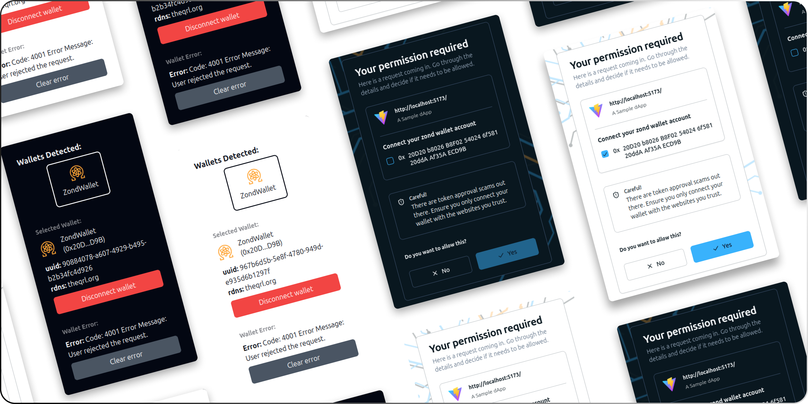

# Zond Web3 Wallet dApp Example

A dApp web application for demonstrating the connectivity(based on EIP-6963) to the Zond Web3 Wallet web extension.

The application renders 3 sections:

- **Detected Wallets:** Displays all the wallets(supporting EIP-6963) installed in the browser. The wallet's icon and name is displayed. To connect to a wallet, click on the desired wallet.
- **Selected Wallet:** On succesfully connecting to a wallet, the wallet name, connected account address, uuid and rdns is displayed in this section.
- **Wallet Error:** On rejecting the connection request, or if any errors are thrown, it is displayed in this section.

## :keyboard: Run locally

- Run `git clone https://github.com/theQRL/zond-web3-wallet-dapp-example.git` for cloning this repo to your machine.
- Run `npm install` for installing all dependencies of this project.
- Run `npm run dev` to run the application locally. By default, the application will be running at `http://localhost:5173/`.

## :link: JSON-RPC API details

Communication between a dApp and Zond Web3 Wallet happens via JSON-RPC API requests.

### Restricted Methods

The methods when called, asks for user approval before executing. A request screen will be presented with an option to either approve or reject the request.

#### 1. zond_requestAccounts

A method that prompts the user to connect their Zond account(s) with the dApp.

- ##### Request

> ```typescript
> const accounts = await provider.request({
>   method: "zond_requestAccounts",
>   params: [],
> });
> ```

- ##### Response

> ```json
> [
>   "Z208318ecd68f26726CE7C54b29CaBA94584969B6",
>   "Z20E7Bde67f00EA38ABb2aC57e1B0DD93f518446c"
> ]
> ```

#### 2. zond_sendTransaction

A method that prompts the user to make a transaction like ZND transfer, contract deployment and contract interaction.

- ##### Request

> ```typescript
> const txHash = await provider.request({
>   method: "zond_sendTransaction",
>   params: [
>     {
>       to: "Z20E7Bde67f00EA38ABb2aC57e1B0DD93f518446c",
>       from: "Z208318ecd68f26726CE7C54b29CaBA94584969B6",
>       gas: "0x51bc",
>       value: "0x33",
>       data: "0x",
>       gasPrice: "0x777",
>     },
>   ],
> });
> ```

- ##### Response

> ```json
> "0x3e306b5a5a37532e1734503f7d2427a86f2c992fbe471f5be403b9f734e661c5"
> ```
